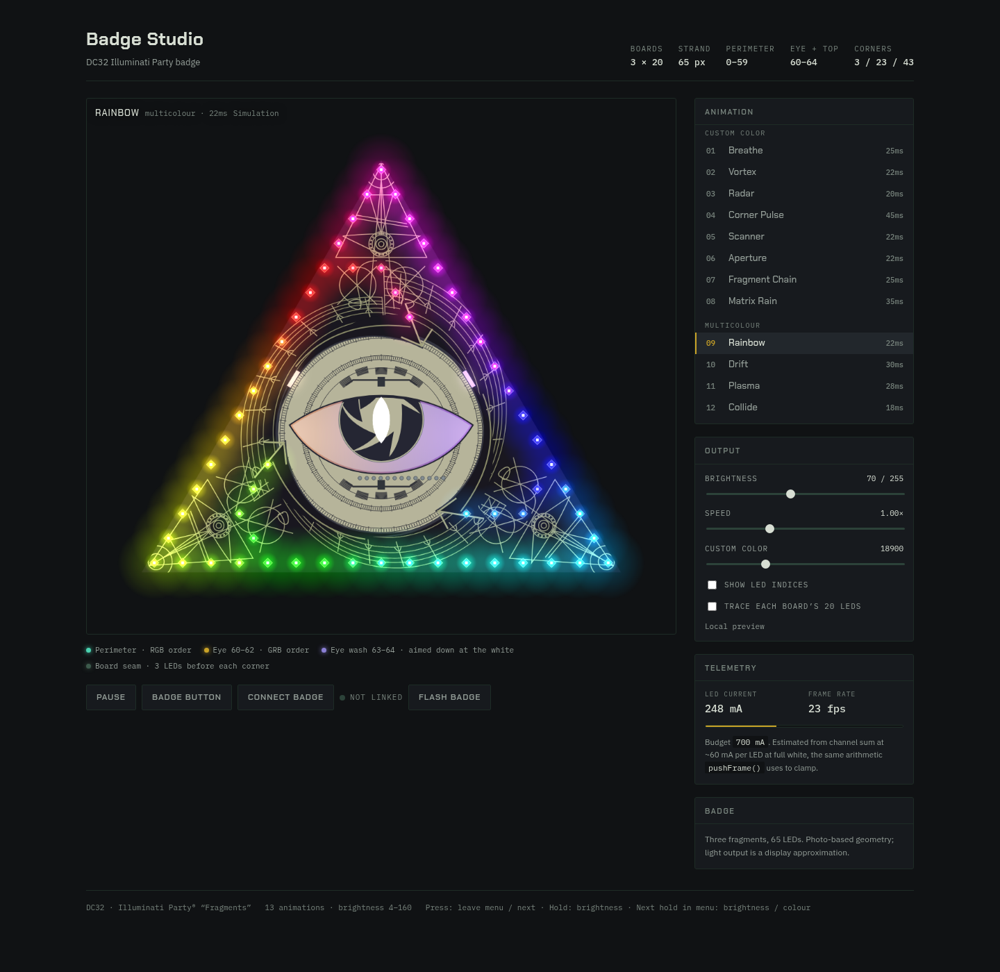

# DC32 IP Badge - Fragments

Welcome to the Illuminati Party® badge 'Fragments' for 2024 (DC32).

This fork adds rewritten animation firmware and Badge Studio for browser control.
The original conference sketch is preserved unchanged as `ConferenceCode_v1`.

[](https://neednotapply.github.io/DC32-IP-Fragments/)

| | |
|---|---|
| `DC32_Fragments.ino` | Firmware. 13 animations, persistent output settings, USB serial control. |
| `studio.html` | Browser simulator, live badge control, and firmware installer. |
| `firmware/` | Pre-built images and the browser installer manifest. |
| `manifest.webmanifest`, `sw.js` | Web app manifest and offline service worker. |
| `assets/` | Badge mark, favicon and installable app icons. |
| `tests/button-gestures.cjs` | Host-side tests of the firmware button handler. |
| `tests/animations.cjs` | Firmware and simulator animation regression checks. |
| `ConferenceCode_v1` | The original conference sketch, untouched. |
| `DC32 Stand v2.stl` | Printable stand. |

---

## Setup

Either toolchain works. The IDE is the gentler path; `arduino-cli` is what this
fork was built and flashed with.

The repository root is the Arduino sketch folder. Name the checkout folder
`DC32_Fragments` so it matches `DC32_Fragments.ino`, as required by Arduino.
For example, clone with `git clone https://github.com/neednotapply/DC32-IP-Fragments.git DC32_Fragments`.
When extracting a GitHub ZIP, rename the resulting folder to `DC32_Fragments`.
Run the commands below from the repository root.

**Arduino IDE**

1. Install the Arduino IDE — https://www.arduino.cc/en/software
2. Tools → Board → Boards Manager, search **esp32** by Espressif, install it.
3. Tools → Manage Libraries, search **Adafruit NeoPixel**, install it. Accept the
   dependency prompts.
4. Tools → Board → **ESP32 Dev Module**.
5. Tools → Port → the badge's port. Usually the highest COM number on Windows,
   typically `/dev/ttyUSB0` on Linux.

**arduino-cli**

```bash
arduino-cli core install esp32:esp32
arduino-cli lib install "Adafruit NeoPixel"
```

## Flashing

Plug the badge in **and switch it on**. The USB-serial chip is powered from USB
and enumerates a port either way, so a port appearing tells you nothing about
whether the ESP32 has power — a badge left switched off looks exactly like a
wiring fault.

### From the browser, with nothing installed

The [hosted Badge Studio](https://neednotapply.github.io/DC32-IP-Fragments/) can
flash the badge itself — press **Flash badge**, pick the port, done. It uses
[ESP Web Tools](https://esphome.github.io/esp-web-tools/) over Web Serial, so it
needs Chrome or Edge and an `https` page; the pre-built image lives in
`firmware/`. Disconnect the studio first if it is already linked, since the two
cannot hold the same port at once.

### Installing the studio

The studio is a Progressive Web App, so it can be installed and then opened
without a browser window — useful on a conference floor, where the hall wifi is
the least reliable part of the setup. Use **Install** in the transport row, or
the browser's own install control in the address bar.

A service worker (`sw.js`) caches the page and all four firmware images at
install time, so a badge can still be flashed with the network completely gone.
Pages and firmware are fetched network-first and fall back to the cache, which
means an online visit always flashes the current build and never a stale one;
icons and fonts are served cache-first. Web Serial is still Chrome or Edge on
desktop only — installing it on a phone gets the simulator, not the flasher.

The one gap: ESP Web Tools loads some of itself lazily from unpkg, so the very
first flash has to happen online. After that it is cached with the rest.

To refresh the images after changing the firmware (using ESP32 core 3.3.11):

```bash
arduino-cli compile --fqbn esp32:esp32:esp32 --output-dir /tmp/fw .
cp /tmp/fw/DC32_Fragments.ino.bootloader.bin firmware/bootloader.bin
cp /tmp/fw/DC32_Fragments.ino.partitions.bin firmware/partitions.bin
cp /tmp/fw/DC32_Fragments.ino.bin firmware/application.bin
cp ~/.arduino15/packages/esp32/hardware/esp32/3.3.11/tools/partitions/boot_app0.bin firmware/boot_app0.bin
esptool --chip esp32 merge-bin -o firmware/fragments-esp32.bin \
  0x1000  firmware/bootloader.bin \
  0x8000  firmware/partitions.bin \
  0xe000  firmware/boot_app0.bin \
  0x10000 firmware/application.bin
```

Merge only the used region as above — `arduino-cli`'s own `.merged.bin` is padded
to the full 4 MB flash size, which is eleven times larger for no benefit.
The browser manifest uses the four separate images, leaving the NVS region at
`0x9000..0xdfff` untouched during updates. The merged image is for a fresh install:
writing it at zero also erases settings in that gap. Leave **Erase device**
unchecked in the browser installer to retain settings. The erase prompt must
remain enabled: ESP Web Tools otherwise defaults to a full erase for firmware
without Improv support.

### From a toolchain

In the IDE, open `DC32_Fragments.ino` and press Upload. Or:

```bash
arduino-cli compile --fqbn esp32:esp32:esp32 .
arduino-cli upload -p /dev/ttyUSB0 --fqbn esp32:esp32:esp32 .
```

A serial monitor at **115200** baud reports the animation and brightness on every
change, which is the quickest way to see whether the button is behaving:

```
[0/12] Boot Sequence
Fragments: 13 animations, brightness 4..160.
  short press        = leave menu, or next animation
  hold               = ramp brightness, turns round at each end
  next hold in menu  = switch brightness / colour
```

### If it will not connect

`Failed to connect … No serial data received` at every baud rate means the chip is
not answering at all. That is a power or cabling problem, not something upload
settings will fix. In order of likelihood:

1. **The badge is switched off.** By far the most common cause.
2. Flat battery — the ESP32 may not come up even with USB attached.
3. Manual bootloader entry, if your board exposes the pins: hold **BOOT** (GPIO0),
   tap **EN/RST**, then release BOOT once the upload begins.

**Do not hold the badge button while flashing.** It is on GPIO12, which is MTDI,
an ESP32 strapping pin — see [The button is active HIGH](#the-button-is-active-high).

Built clean against esp32 core 3.3.11 with Adafruit NeoPixel 1.15.5:
338 KB flash (25%), 25 KB RAM (7%).

### Regression checks

Run `node tests/button-gestures.cjs` with Node.js and `g++` installed. It compiles
the actual firmware button handler on the host and checks debounce, long-press
thresholds, brightness/colour menu switching, idle timeouts, holding across a
deadline, clock rollover, and resuming paused playback. Temporary build files
are removed after the test.

Run `node tests/animations.cjs` to check both animation implementations: Boot's
apex start, Aperture's three anchor LEDs, Rainbow's eye sampling and list order,
Scanner's eye sweep, downward rain paths, and saved-animation index migration.

For browser changes, check the studio at desktop and mobile sizes, then verify
connect/disconnect, live frames, control changes, and saved-state confirmation
with the badge. Hardware timing and reboot persistence still need a real device.

---

## Controls

| Input | Action |
|---|---|
| Short press, outside a menu | Next animation |
| Short press in either adjustment menu | Leave the menu; keep the current animation |
| Hold (after 0.7s), outside a menu | Open brightness; keep holding to ramp it |
| Long press in the brightness menu | Switch to colour; keep holding to ramp it |
| Long press in the colour menu | Switch to brightness; keep holding to ramp it |

Any badge-button press resumes a paused animation immediately, then follows the
normal gesture: a short release leaves an open menu or advances the animation,
and holding adjusts
brightness or colour. This applies to both the physical and browser badge button.

The adjustment menu stays open for three seconds after release. Press again
within that window and hold for 0.7 seconds to switch between brightness and
colour. Starting a press keeps the menu open while the hold is recognised,
even near the end of the timeout. Each hold switches only once, then ramps the
selected value until release. Brightness turns round at each end; colour wraps
around the wheel. Switching menus preserves both adjustments and the animation.
A short press leaves the menu without changing the animation. Three seconds idle
returns to the animation; the next long press opens brightness again. Menu
timing uses real time, independent of animation speed.

While you are navigating — stepping animations, ramping brightness, ramping
colour — the whole badge sits lit in the custom color at the set brightness, so a
glance tells you what it is configured to. The animation number rides on top of
that in the **opposite hue**, saturated harder than the ink.

A brighter shade of the ink does not survive the diffuser. With the whole board
lit, neighbouring LEDs blend into each other and a brightness step smears across
the boundary until the count is hard to read; opposite hues stay separate however
much they bleed. Measured after dividing luminance out, the fill and marker keep
4.1–8.2 of chroma separation right round the wheel — green against violet, cyan
against red, blue against yellow. `INK_SAT` and `MARK_SAT` set the two
saturations, `NAV_FILL` and `NAV_MARK` the two levels.

Both give a readout on the badge itself: a bar around the perimeter for
brightness, or a count of lit pixels from the bottom-right corner for the
animation number. Both count in perimeter order, so they run down the edge
rather than turning off into a board's leg partway along.

### The button is active HIGH

The original sketch used `INPUT_PULLUP` and treated LOW as pressed. On this
hardware that is backwards, and it is why the original carries the comment
*"There is an issue on how mode is being set. The code starts at 1."*

GPIO12 is MTDI, an ESP32 strapping pin that must be low at boot or the chip sets
`VDD_SDIO` to 1.8 V and will not start from 3.3 V flash. The board therefore has
an external pull-down on it, and that pull-down beats the chip's ~45 kΩ internal
pull-up: with `INPUT_PULLUP` the pin reads LOW forever, pressed or not. A GPIO
scan confirms it — every other input idles at 1, GPIO12 alone sits at 0 even
with the internal pull-up enabled.

So the original never actually read the button. It saw one HIGH→LOW edge at
startup, advanced to mode 1, and never registered another press. This firmware
uses `INPUT_PULLDOWN` and treats HIGH as pressed (`BUTTON_ACTIVE_HIGH`).

If you are adapting this for a board that really is wired active-low, set
`BUTTON_ACTIVE_HIGH` to 0 — `serviceButton()` normalises to pressed/not-pressed
at the top, so nothing else needs touching.

## Animations

| # | Name | Family |
|---|---|---|
| 0 | Boot Sequence | Outline trace from apex LED #43, legs dark |
| 1 | Breathe | Outline and eye breathing together |
| 2 | Vortex | Three arms winding inward, one per board |
| 3 | Radar | One beam sweeping, with a decaying wake |
| 4 | Corner Pulse | Pulses out from each corner, meeting at the midpoints |
| 5 | Scanner | A horizontal beam sweeps vertically through the outline and all five eye LEDs |
| 6 | Aperture | Blades retract to #00, #20, #40, then close and flash |
| 7 | Fragment Chain | The `DOUT`→`DIN` data path, made visible |
| 8 | Matrix Rain | Downward white drops fade through the custom color to black |
| 9 | Rainbow | Multicoloured, eye samples the nearest outline colours |
| 10 | Drift | Multicoloured |
| 11 | Plasma | Multicoloured |
| 12 | Collide | Multicoloured — two travellers head on |

**0–8 follow the custom color** — hold for brightness, then hold again for colour and they move with
it. **9–12 are multicoloured by design** and ignore the setting, so they are
grouped at the end rather than scattered through the list, where the setting
looked broken every time it landed on one that does not use it.

Everything that goes round the outline turns clockwise seen from the front —
Vortex and Radar, plus Drift and Rainbow. Reversing a gradient means negating
the *position* term rather than time: flipping time on Rainbow would run the hue
wheel backwards instead of moving the band the other way.

Both spirals turn clockwise seen from the front.

Both spirals turn clockwise seen from the front.

The three original conference flickers are not in this firmware. They are still
in `ConferenceCode_v1`, unchanged, if you want them back.

Set `AUTO_CYCLE_MS` to a number of milliseconds to have the badge advance on its
own.

## Settings

Animation, brightness, colour, speed (0.10x to 3.00x, default 1.00x), and play/pause survive a
power cycle. They are stored together in one versioned NVS record. Existing
firmware's mode/brightness/colour keys are migrated on the first saved change.
Version 2 also remaps the old multicolour indices so moving Rainbow to the front
does not change the saved animation. Use the updated studio with updated firmware
so their animation lists agree.
Button timing and the save delay use real time, independent of animation speed.

Writes are held back until things have been quiet for `SETTINGS_SAVE_MS`. NVS
lives in flash and flash wears out; a brightness ramp changes the value
twenty-five times a second, so committing each step would put tens of thousands
of writes through it in an evening of fiddling. Waiting for the quiet turns a
whole ramp into a single write. A record that points past the end of the
animation table — after the list shrinks, say — is discarded rather than used.
The studio shows **Saving to badge...** until the write succeeds, then **Saved on
badge**. Wait for that confirmation before cutting power, or press **Save now**
to commit immediately. A failed write stays pending and is retried. LED indices
and path overlays are browser view preferences, stored locally; they do not
change the badge's output.

## Control over USB serial

The radio on this board is unusable — see [Why the radio is dead](#why-the-radio-is-dead)
— so the badge is driven down the same USB lead that powers and flashes it.

The protocol is line-based ASCII at 115200 baud, so you can drive it by hand
from `screen`, `minicom` or the Arduino serial monitor:

| send | does |
|---|---|
| `?` | report state |
| `l` | list animations |
| `n` | next animation |
| `m <n>` | select animation `n` |
| `b <n>` | brightness, 4..160 |
| `h <n>` | hue, 0..65535 |
| `s <n>` | speed in percent, 10..300 |
| `p <n>` | play (1) or pause (0) |
| `c <mode> <bright> <hue> <speed> <playing>` | set all output settings together |
| `w` | save pending settings immediately |
| `f 1` / `f 0` | subscribe / unsubscribe to live LED frames |

The badge replies `S <mode> <bright> <hue> <speed> <playing> <dirty>` after anything that changes state —
including a press of the physical button — so whatever is on the other end stays
in step. `dirty=1` means changes are not saved yet; `dirty=0` confirms the saved
state. Out-of-range values are refused with `ERR`, since a bad animation index
would walk off the end of the table.

Live frames are `F <sequence> <animation-ms> <requested-mA> <limited> <hex-RGB>`.
The payload is 390 hex digits: 65 logical RGB triplets after gamma, brightness
and current limiting, before the mixed RGB/GRB wire order. Frames are sampled at
up to 20 Hz to fit 115200 baud. Renew `f 1` every two seconds; the subscription
expires after five seconds without renewal. Transmission skips frames if the TX
buffer is busy, keeping animations responsive.

```
screen /dev/ttyUSB0 115200
```

### From the Badge Studio

Open `studio.html` in **Chrome or Edge**, press **Connect badge** and pick the
badge's port. The page then mirrors the badge both ways: move a slider and the
badge follows; press the badge's button and the page follows.
With updated firmware, **Live badge** renders the actual output stream, including
random effects and physical-button feedback. It has serial/display latency and
samples at 20 Hz; it is not an optical measurement. An interrupted stream is
marked instead of silently replaced by a free-running simulation. Older firmware
still supports mode, brightness and hue; speed and pause are disabled until updated.

Two constraints worth knowing. Web Serial is Chrome/Edge only — Firefox and
Safari do not implement it. And it needs a top-level page: in a cross-origin
iframe it requires `allow="serial"`, so open the file directly rather than
through an embedded copy.

### Why the radio is dead

This board's 40 MHz crystal runs **+153.8 ppm fast**, measured by regressing the
badge's own `millis()` against an NTP-disciplined clock over 596 samples — and
confirmed at +155.6 ppm with the CPU reclocked from 240 MHz to 80 MHz, which
rules out a PLL or timer artefact. The same crystal sets the RF carrier, so it
sits about **375 kHz off frequency at 2.44 GHz**: six times outside WiFi's ±25 ppm
tolerance and three times outside BLE's ±50 ppm.

That single fault explains everything observed:

| symptom | why |
|---|---|
| WiFi receive is perfect | a receiver locks AFC onto the incoming carrier, cancelling its own error |
| WiFi transmit never heard | no AP can demodulate a carrier that far off |
| BLE advertising seen by one laptop only | GFSK is robust; that radio's capture range is just wide enough |
| a phone one inch away sees nothing | different receiver, tighter capture range |
| BLE connections never establish | the badge's replies are never decoded, so the link never completes |

The clincher was a control test: a phone that could not see the badge from one
inch found *a laptop* advertising the identical BLE MIDI UUID within seconds.
One receiver decoding what a closer one cannot is off-frequency transmit, not
weak transmit.

No firmware setting trims a crystal — the ESP32-D0WDQ6 has no internal load-cap
trim, that arrived with the C3/S3 — so this is a hardware fault. The error is in
the *fast* direction, which points at load capacitance being too low.

Dropping both radio stacks took the build from **86% of flash to 24%**.


## Badge Studio

Open `studio.html` in any browser — no build step, no server. It runs the
same sine table, the same `ColorHSV`, the same gamma curve and the same current
limiter as the firmware, so colors and timing carry over. Click an animation,
drag the speed slider, hover an LED for its strand index and live RGB, or press
and hold the on-screen badge button to feel the real control scheme.

It is also installable, and caches itself and the firmware for offline use — see
[Installing the studio](#installing-the-studio).

---

## How the rewrite differs

**Non-blocking.** The original ran `delay(90)` inside each animation, so a
button press only registered if you happened to be holding it during the one
`digitalRead()` per cycle. Everything now runs off a frame timer and the button
is sampled every pass of `loop()`.

**The button is read correctly.** The original had it wired backwards for this
hardware and never actually registered a press — it saw one edge at startup and
nothing after. Its own comment records the symptom. See
[The button is active HIGH](#the-button-is-active-high).

**One place for the GRB problem.** LEDs 60–64 are from a different vendor and
take their bytes in GRB order while the strand is initialized `NEO_RGB`. The
original hand-swapped red and green in every color constant destined for those
five (hence `rightAngleGreen` being made of red). That fixup now happens once,
in `pushFrame()`, so animations are written in plain RGB throughout. If your
board splits somewhere other than LED 60, move `GRB_FIRST`.

**Geometry instead of indices.** `buildGeometry()` builds lookup tables for each
perimeter LED's position on the triangle and its distance from the eye, so
animations can say "sweep upward" or "ripple out from the eye" rather than
hardcoding strand numbers.

**Brightness and power.** Animations are written at the full 0–255 range and
scaled at output. Brightness is continuous rather than a few preset steps: hold
the button and it ramps, turning round at each end so one button covers both
directions — about 58 steps from `BRIGHT_MIN` to `BRIGHT_MAX`, 2.3 s end to end.
Each step is proportional to where it already is, roughly 6%, because the eye
reads brightness as a ratio and not a difference: a jump of 4 is enormous down
at 8 and invisible up at 140. A current
limiter estimates draw from the channel sum and scales the whole frame down if
it would exceed `POWER_LIMIT_MA` (default 700 mA) — 65 WS2812s at full white is
about 3.9 A, which nothing on this badge wants to supply.

Note that at the lower brightness levels an 8-bit PWM output has real limits.
Gamma runs before the brightness scale, so with the cap at 45/255 the chain is
`fb 45 -> gamma 6 -> output 1`, and `fb 80 -> gamma 20 -> output 3`. **Anything
authored below roughly 80 does not reach the LED at all.**

The same power law bites colour. It crushes the minor channels much harder than
the dominant one, so authoring 55 red against 255 green does not give 22% red at
the LED — it gives about 3%, and what should be a sage green comes out neon. The
custom color is generated from a selectable hue at `INK_SAT` 131, landing on
0.35 : 1.00 : 0.21 at the strip. Scaling all three channels together preserves
the ratio, so a tint survives being dimmed.

There is deliberately no paler variant of the ink. Anything desaturated far
enough to sit between the ink and white just reads as *white* on an emissive
LED — which is exactly what the eye and its wash looked like before. The eye
stands apart by being brighter, not by being washed out.

This is also the easiest way to write an animation that looks right in the
framebuffer and is invisible on the badge — a dim background field authored at
45–130 measures as "busy" and lands as 57% of the LEDs completely dark. If an
effect needs a floor that the viewer can actually see, put it at 70 or above and
measure at the strip, not in `fb[]`.

## How the badge is built

The triangle is not one board. It is **three boards of 20 LEDs each**, chained
`DOUT` → `DIN` through the four-pin headers on the back, and twisted together
so they pinwheel into a triangle — which is where the name comes from, and why
the corner LEDs land 20 apart at strand indices 3, 23 and 43.

Each board's twenty LEDs, walked in strand order: **3** up the previous edge,
**the point**, **12** down the next edge, then a **turn, 2, turn, 2**. Both
turns measure close to 60° in the same direction — 120° together, the exterior
angle of an equilateral corner — so the tail leaves the perimeter rather than
following it.

That is what makes an edge sixteen LED-spacings, not twenty: an edge carries its
corner, that board's twelve, and the next board's three. Three edges of sixteen
is 48 LEDs on the outline, and the 12 tail LEDs sit inside it. `TAIL_A1`,
`TAIL_A2` and `EDGE_STEPS` in the sketch hold those numbers.

`fragOf()`, `posInFrag()` and `fragCorner()` expose that structure, and the two
Fragments animations are built on it. The arrangement is also why the eye
graphic reads as a camera aperture, which is what `Aperture` plays with.

## Three ways to walk the badge

Getting this wrong is the easiest mistake to make here, because strand order
looks like it ought to be the outline and isn't.

| | | |
|---|---|---|
| **Strand order** | `0..59` | What the wire does. It runs an edge, dives off the outline into that board's tail, then jumps out to the next board's leg. |
| **Perimeter order** | `PERIM[0..47]` | The 48 outline LEDs in the order your eye walks them, from corner BR. |
| **Position** | `ringX` / `ringY` | No ordering at all — the badge is a screen and an LED is lit by where it sits. |
| **Polar** | `polR` / `polA` | Position again, but about the eye — radius and angle, for anything that turns or winds. |

Anything that reads as **motion along an edge** belongs in perimeter order. A
head walking strand order veers into the middle of the badge every twenty LEDs,
does four, and pops back out. Collide, Rainbow, Corner Pulse and Boot Sequence
use perimeter order to follow the outline.

`spillTail()` lets those effects run down a board's four tail LEDs as they pass
its attachment point, so the inner LEDs join the motion instead of sitting dead
through every chase.

Plasma and Scanner are **positional** — they never referenced order in the first
place, which is why they never had this problem.
Matrix Rain is positional too: up to six drops follow columns of real LEDs,
stepping strictly downward. Each drop has its own pace, with a 35 ms frame
interval at the default speed. New arrivals get a softened white highlight,
then gradually dim through the selected custom color to black until another
drop refreshes them. The trail lives **on the LEDs**, so it remains visible
across the large gaps between physical lights.

Drops also take their column from a randomly chosen LED rather than a random x.
Picking x freely drops a third of them down stripes of bare board where nothing
can be struck; seeding from an LED guarantees a target and naturally favours the
busier columns. Outline and tails are both part of the wall; only the eye is out.
Fragment Chain is the one animation that genuinely wants **strand order**: it is
drawing the data path.

Both Spiral animations are **polar**. Because the badge has genuine radial
structure — outline at mean radius 164, the twelve tail LEDs at 133, the eye at
52 — a spiral written against `polR` / `polA` sweeps through all three bands as
one surface, curving in off the edge, through the tails, to the eye. They are all
phase = `a*angle + b*radius + c*time`: `a` sets the arm count, `b` how tightly
they wind, the sign of `a` sets which way it turns and the sign of `b` sets
whether it travels in or out.

Keep `b` near 1. With only three radial bands, a coefficient of 2 or 3 wraps the
phase right round between them, and the winding aliases into arbitrary per-band
offsets rather than reading as a spiral — the pattern still moves, but it stops
having a coherent direction.

## Layout assumptions

Increasing strand index runs clockwise from the bottom-right corner with the
apex up. Two things remain estimates, both a few lines near the top of the
sketch:

- `auxX` / `auxY` place the eye (60–62) and the pair above it (63–64), indexed
  by strand position rather than by name. These are measured off photographs of
  the lit badge — note that 63/64 are *not* near the apex despite the original's
  "top of board" comment; they flank the eye from above, inside the mandala.
- **The strand reaches the right of the eye before the left.** The original
  labelled 61 as left and that was wrong: driven that way, Radar's beam reached
  the two sides in the wrong order and the eye read mirrored against the
  simulator. `EYE_R` is 61 and `EYE_L` is 62. Both halves have to agree — the
  naming *and* `auxX`, which is what tells the geometry where each index sits.
- 63/64 are the same class of assumption and have not been confirmed. If the top
  pair ever looks mirrored, swap `auxX[3]` and `auxX[4]`. It is much less visible
  than the eye pair was, since the two sit close together and both wash the same
  sclera.

**There is a blue power LED behind the eye, and it is always on.** So "off" is
not a colour the badge can show there — an eye left dark does not read as dark,
it reads as blue. `floorEye()` lifts everything bound for the strip to
`EYE_FLOOR`: a tint already in place scales up with its hue intact, and an eye
left completely dark takes the default green instead of the power LED's blue.
Raise `EYE_FLOOR` if blue still shows through.

**LEDs 63 and 64 are aimed down into the white of the eye.** They are wash
lights, not point accents: whatever colour they carry becomes the colour of the
sclera, which makes them the highest-leverage pair on the badge for selling
"the eye is awake". Give them the eye's colour, never the board's — a teal pair
over a warm eye turns the whole white teal and it stops reading as an eye. Every
animation drives them that way — `Collide` goes furthest with it, putting one
traveller's colour on each side so the two halves of the white glow in the two
colours that are about to hit.
- `TRI_ASPECT` is the triangle's height over its half-width, set to 1.732 for
  equilateral (photos measure ≈1.72). It sets the vertical scale for `polR`, so
  the spirals are what notice if it is wrong.

The tail geometry is measured off a photograph of a single board and reproduces
it to within a tenth of an LED-spacing. Both consequences are confirmed against
the hardware: **17 LEDs from one corner LED to the next inclusive**, and **12
LEDs sitting inside the outline** in addition to the five at the eye.

Turn on *Trace each board's 20 LEDs* in the Badge Studio to see the modelled path
for each board next to the real thing.

---

Original conference sketch by [Kredence](https://github.com/Kredence/DC32_Fragments),
itself adapted from Adafruit's NeoPixel example.
